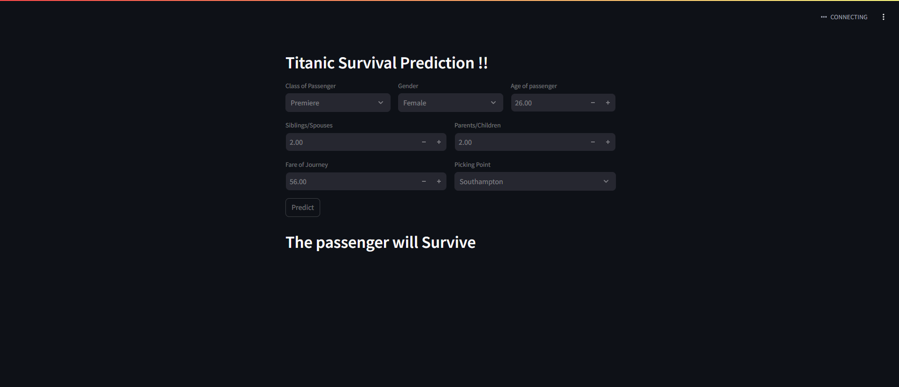

#  Titanic Survival Prediction — End-to-End Machine Learning Project


Predict whether a passenger would have survived the Titanic disaster based on personal and ticket information.  
This project demonstrates the **entire ML lifecycle** — from **data preprocessing, feature engineering, model building, and evaluation** to **deployment as a web application**.
This **end-to-end machine learning project** covers **data cleaning, EDA, feature engineering, model building, evaluation, and deployment**.

---
## 🛠 Tech Stack
**Languages & Libraries:** Python, Pandas, NumPy, Matplotlib, Seaborn, Scikit-learn  
**ML Algorithm:** Random Forest Classifier  
**Deployment:** Streamlit  

---

##  Project Structure
```
project-1-titanic-survival/
│
├── titanic.ipynb           # Notebook with EDA, preprocessing, model training
├── main.py                 # Streamlit web app
├── model.pkl               # Saved ML model
├── requirementss.txt        # Dependencies
├── data/                   # Dataset files
│   ├── train.csv
│   ├── test.csv
│   └── gender_submission.csv
|---images
```
---

##  Dataset
**Source:** [Kaggle Titanic Dataset](https://www.kaggle.com/c/titanic)  
**Features:**
- **Pclass** — Passenger class (1, 2, 3)
- **Sex** — Male/Female
- **Age** — Passenger’s age in years
- **SibSp** — Siblings/Spouses aboard
- **Parch** — Parents/Children aboard
- **Fare** — Ticket fare
- **Embarked** — Port of embarkation (C, Q, S)

**Target:**
- **Survived** — 1 if survived, 0 if not

---

## 🛠 Workflow
1. **Data Preprocessing**
   - Handle missing values
   - Encode categorical variables
   - Scale numerical features
2. **Exploratory Data Analysis (EDA)**
   - Visualize survival rates by gender, class, and age
   - Correlation analysis
3. **Feature Engineering**
   - Transform categorical to numerical
4. **Model Training**
   - RandomForest Classifier
5. **Evaluation**
   - Accuracy, F1-score, Confusion Matrix
6. **Deployment**
   - Streamlit app for live predictions

---

## Results & Insights
- **Accuracy:** ~85% (RandomForest on validation set)  
- **Key Findings:**
  - Women had a **significantly higher** survival rate than men
  - First-class passengers were more likely to survive
  - Younger passengers had slightly better survival odds


---
**Key Findings:**  
- Women had a **much higher survival rate** than men  
- First-class passengers more likely to survive  
- Younger passengers had a slightly better survival rate  

---

##  Run Locally
### 1️⃣ Clone the Repository
```bash
git clone https://github.com/sanhith30/Data-Science-And-ML-Projects.git
cd titanic survival prediction
```
### 2️⃣ Install Requirements
```bash
pip install -r requirements.txt
```
### 3️⃣ Run the Notebook
```bash
jupyter notebook titanic.ipynb
```
### 4️⃣ Run the Streamlit App
```bash
streamlit run main.py
```

---

##  Live Demo
<a href="https://titanic-survival-prediction-sanhith.streamlit.app/" target="_blank">Live Demo Link</a>

---

##  Screenshots


##  Future Improvements
- Try Gradient Boosting (XGBoost, LightGBM) for better accuracy
- Perform hyperparameter tuning with GridSearchCV
- Add SHAP/feature importance plots for explainability
- Improve UI/UX in the Streamlit app

---


##  Skills Demonstrated
- Data Preprocessing
- Exploratory Data Analysis
- Feature Engineering
- Machine Learning Model Training
- Model Evaluation
- Web App Deployment


##  Contact
**Author:** THIKKAVARAPU SANHITH
[LinkedIn](https://linkedin.com/in/sanhith30) | [GitHub](https://github.com/sanhith30)
